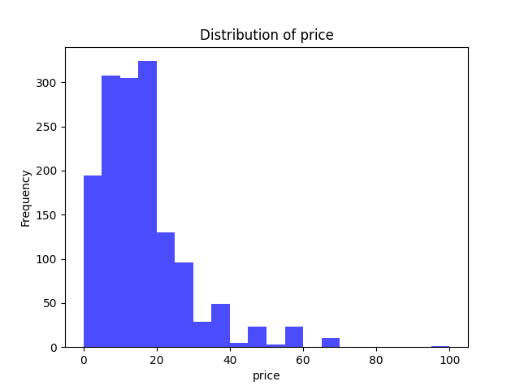

# TengyuHsiao_IDS_project9

This Project reads from a csv file and produces some statistics and visualization from it using Google Colab Nootbook.

The csv file I am using is Top 1500 games on steam by revenue 09-09-2024(https://www.kaggle.com/datasets/alicemtopcu/top-1500-games-on-steam-by-revenue-09-09-2024?resource=download)

I am curious about price of the game:

Summary Statistics for price:

Mean: 17.519513333333276

Median: 14.99

Standard Deviation: 12.646611586491012

This is a histogram of the price:

The histogram is right-skewed, meaning that most of the data is concentrated on the lower end of the price scale. The mode is around 10-20, suggesting that most items are priced within this range
