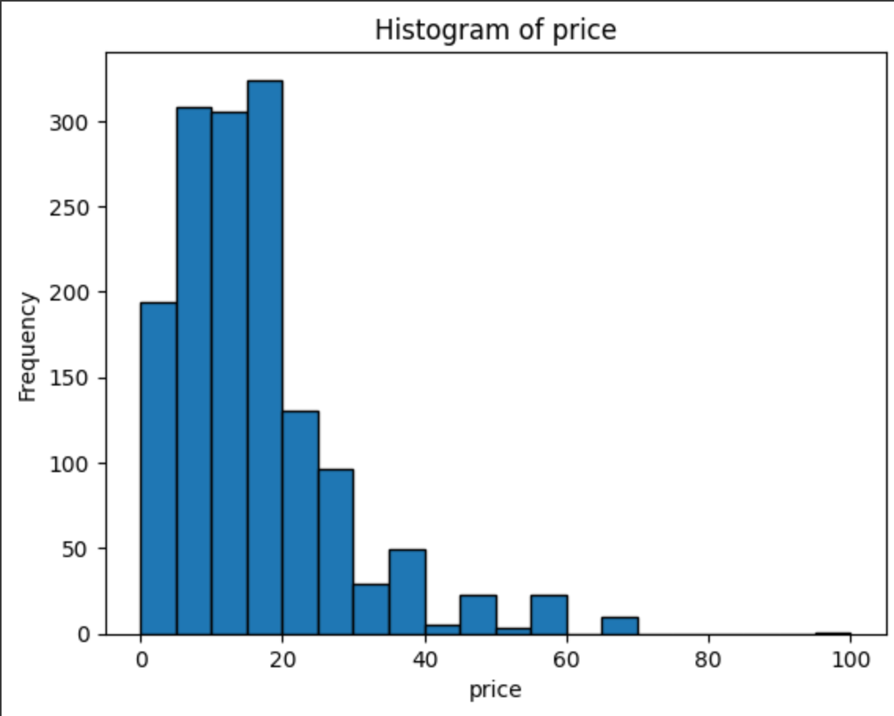
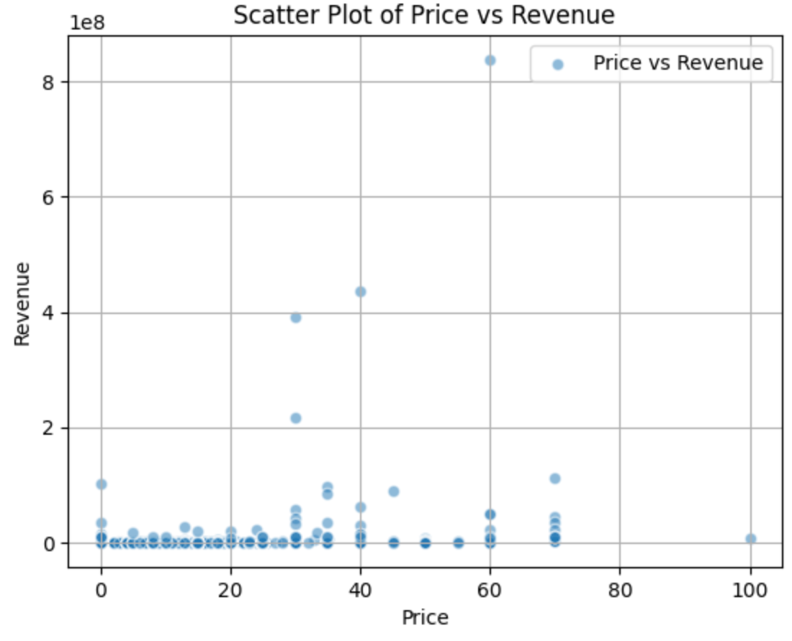

# TengyuHsiao_IDS_project2

This Project reads from a csv file and produces some statistics and visualization from it.

The csv file I am using is Top 1500 games on steam by revenue 09-09-2024(https://www.kaggle.com/datasets/alicemtopcu/top-1500-games-on-steam-by-revenue-09-09-2024?resource=download)

I am curious about price of the game and the revenue, so I produce some statistics about these two columns, here are the results:
Price:
 17.519513333333332
Mean:
 17.519513333333332

Median:
 14.99

Standard Deviation:
 12.646611586491009

 revenue:
 2632381.9826861774
Mean:
 2632381.9826861774

Median:
 109053.0

Standard Deviation:
 27810239.622256387

This is a histogram of the price:

The histogram is right-skewed, meaning that most of the data is concentrated on the lower end of the price scale. The mode is around 10-20, suggesting that most items are priced within this range

I am also curious about the relationship between price and revenue, so I plot a scatterplot:

There appears to be a positive correlation between price and revenue for certain items, particularly those few in the higher price ranges that have managed to generate substantial revenue. However, the correlation is not strong across all price ranges as many high-priced items do not generate proportionately higher revenues.