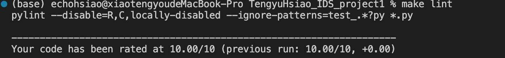
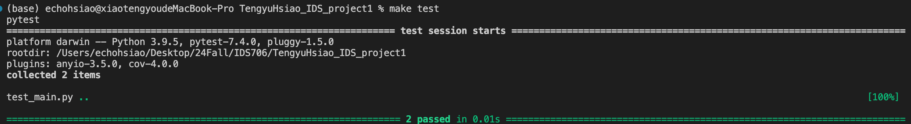
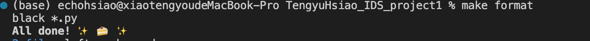

# TengyuHsiao_IDS_project1

- ``.devcontainer`` includes a Dockerfile and devcontainer.json.
                The 'Dockerfile' within this folder specifies how the container should be built, and other settings in this directory may control development environment configurations.

- ``workflows`` includes GitHub Actions, which contain configuration files for setting up automated build, test, and deployment pipelines for your project.

- ``Makefile`` is a configuration file used in Unix-based systems for automating tasks and building software. It contains instructions and dependencies for compiling code, running tests, and other development tasks.

- ``README.md`` is the instruction file for the readers.

- ``main.py`` is a Python file.

- ``requirements.txt`` is to specify the dependencies (libraries and packages) required to run the project.

- ``test_main.py`` is a test file for main.py that can successfully run in IDEs.

- ``img`` saves the running results.

I use Github Actions to run the Makefile as follows: `make setup`, `make test`, `make format`, `make lint`.The following pictures show the pass results:

